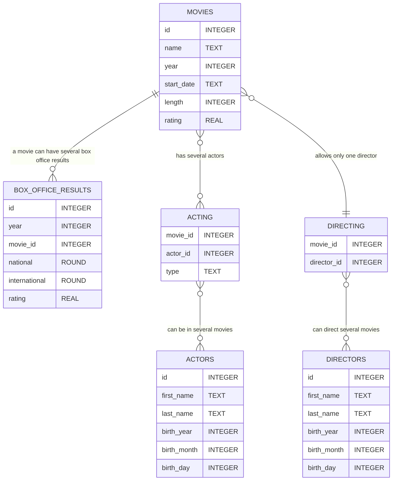

# SQL-Beginner Tutorial Part 2: Data Types and Designing a Database
Welcome back to Part 2 of my SQL Beginner Tutorial. Today, we’ll delve into data types and then proceed to design our first database together.

## Data Types in SQLite

Throughout this tutorial, I’ll primarily use SQLite. However, we’ll also take a short look on MySQL, MariaDB, and PostgreSQL.

SQLite has 6 different data types:
* **TEXT**: any string
* **NUMERIC**: non-decimal or decimal number
* **INTEGER**: non-decimal numbers (e.g., 0, 1, 2, 3, 4…)
* **REAL**: decimal numbers
* **BLOB**: Data is stored exactly as provided — SQLite does not attempt conversion to the column’s data type
* **NULL**: value is unknown or missing

Despite its data types, SQLite is a flexible dynamic type system, also known as type affinity. Essentially, it attempts to convert the provided data into the column’s data type if possible. To grasp this concept, let’s examine an example.


```
CREATE TABLE walking_dead (
    id INTEGER,
    first_name TEXT,
    last_name TEXT ,
    age INTEGER,
    PRIMARY KEY (id)
);

INSERT INTO walking_dead (first_name, last_name, age)
VALUES ("Rick", "Grimes", 37);

+------+------------+-----------+-----+
|  id  | first_name | last_name | age |
+------+------------+-----------+-----+
| 1    | Rick       | Grimes    | 37  |
+------+------------+-----------+-----+

INSERT INTO walking_dead (first_name, last_name, age)
VALUES
("Abraham", "Ford", "fourty-three");

+------+------------+-----------+--------------+
|  id  | first_name | last_name |     age      |
+------+------------+-----------+--------------+
| 1    | Rick       | Grimes    | 37           |
| 2    | Abraham    | Ford      | fourty-three |
+------+------------+-----------+--------------+

SELECT typeof(age) FROM walking_dead WHERE id = 1;
+-------------+
| typeof(age) |
+-------------+
| integer     |
+-------------+

SELECT typeof(age) FROM walking_dead WHERE id = 2;
+-------------+
| typeof(age) |
+-------------+
| text        |
+-------------+
```

Don’t worry. You don’t need to understand of all that yet. We cover that later! For now, let me explain what I did:

I created a table called ‘walking_dead’. ‘id’ has the data type INTEGER, ‘first_name’ and ‘last_name’ have the data type TEXT, and ‘age’ has the data type INTEGER. I then added a set of data with the correct (expected) data type. The second time I added data, I wrote the age as a string.
Then I added a set of data with the correct (expected) data type. The second time I added data, I wrote the age as a string.
In other databases, this would trigger an error, and the data wouldn't be added. However, SQLite attempts to convert the given data into an INTEGER. Since this isn't possible, it saves the data as they are.
To demonstrate that even better what happened to the data, I queried data type of ‘age’ in rows 1 and 2. As you can see, ‘age’ in row 1 is an INTEGER, as intended, but in row 2, it is of data type TEXT.

Let’s try something else.


```
INSERT INTO walking_dead (first_name, last_name, age)
VALUES ("Carl", "Grimes", "16");

SELECT typeof(age) FROM walking_dead WHERE id = 3;

+-------------+
| typeof(age) |
+-------------+
| integer     |
+-------------+
```

Again, I added an age as a string. But this time, the string is a number. Now SQLite succeeds in converting the given data into the column’s data type.

## SQLite STRICT MODE

If you need a more strict behaviour for your application, the STRICT MODE might be a solution for you. Let’s look how that works:

```
CREATE TABLE walking_dead (
    id INTEGER,
    first_name TEXT,
    last_name TEXT ,
    age INTEGER,
    PRIMARY KEY (id)
) STRICT;

INSERT INTO walking_dead (first_name, last_name, age)
VALUES ("Rick", "Grimes", "37");

+----+------------+-----------+-----+
| id | first_name | last_name | age |
+----+------------+-----------+-----+
| 1  | Rick       | Grimes    | 37  |
+----+------------+-----------+-----+

INSERT INTO walking_dead (first_name, last_name, age)
VALUES ("Carl", "Grimes", "sixteen");

Runtime error: cannot store TEXT value in INTEGER column walking_dead.age 
```
To create a table in STRICT MODE, we add the word STRICT while creating the table. I attempted to add Rick with his age written as a string, but still as a number. SQLite tried to convert it and succeeded. However, when I attempted to add Carl to the table, I encountered an error because the TEXT “sixteen” can’t be converted into an INTEGER.

Before we delve into the detailed process of designing a database, let’s explore data types in other SQL databases.

## Data Types in MySQL, MariaDB, and PostgreSQL

While MySQL defaults to STRICT MODE, both MariaDB and PostgreSQL can be set to STRICT MODE. All of them offer various data types for numeric values and string data types. Furthermore, they provide data types for date and time, as well as geometric types. Discussing all of these data types with examples would go beyond the scope of this tutorial.

## Designing a Database in SQLite

Before we design a database, it’s crucial to have a clear understanding of the purpose and requirements. We have to think about corner cases. Think about data, you might want to add in the future and keep that in mind when you plan the relations.

For this tutorial, we’ll design a movie database focusing on films shown in cinemas in 2019. Let’s outline some requirements for the database:

_You are to create a database that gives us on overview over all movies that were in the cinema in the year 2019. Every movie should have the following details: name, length, start date, director and rating. There should be a list of all box offices, national and international. All movies should have a list of the actors. It would be nice if we could see if an actor is a leading actor in a movie._

In my solution I will use 6 tables.
* movies
* actors
* directors
* box_office_results
* acting
* directing

The next step is to create am **ER (Entity Relationship) Diagram** visualizes the relations in your database and helps you to detect flaws. You don’t need to it digitally. It is totally ok, just to use pen and paper. I used the free Markdown tool Mermaid.


Every table has a name and it has columns, that have also a name and optional a data type. I recommend to always use a datatype. So for example in the table movies, there is the column name that has the datatype TEXT. Yes, I said column even though you see rows here. In the ER Diagram we visualize the table with its columns as table with rows. But later, we add data to the table you. Then the names such as id, name, year, rating etc. become columns resp. they become the heading of their columns.

The table movies saves all movies that were in the cinema in the year 2019. We have an id as PRIMARY KEY. Even though the table should only include the movies from the year 2019 I added a column year. I did this because I thought about the case, that we might want to add movies from the year 2018 or 2020. It is easy to implement something like this now then to update the whole table and its entries later.

movies has a relation to box_office_results, acting and directing. It is a 1:n-relation. A movie can have several results from box_office_results because a movie that started in 2019 can still be in the cinema in 2020. To be prepared for a corner case like that I added also a column with year to the table box_office_results. box_office_results has id as PRIMARY KEY and of course movie_id as FOREIGN KEY because of its relation to movies. While a movie can have several results in the box_office_results, a result from box_offices_result can only be associated with one specific movie.

The relation between movies and acting is n:n as well as the relation between actors and acting. A movie has several actors and and actor can be in several movies. The “”link-table” acting the connection between actors and movies. Therefore it has 2 FOREIGN KEYs: movie_id and actor_id. I added also a column called type. Here we will specify if an actor has a leading or a supporting role with the values ‘leading’ or ‘supporting’.

The relation between movies and directing is n:1 and the relation between directing and directors is n:n. A movie should only have one director. But a director can make several movies. I could have saved the director directly in the movies table. But there maybe could be the case that a movie is for some reason directed by 2 directors. That would change the relation between movies and directing to n:n. But we could work with it without any additional changes in the database.
