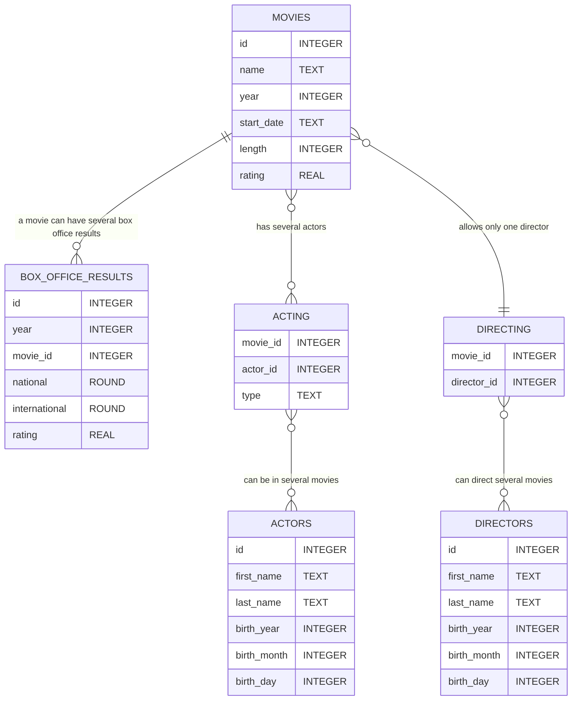

# SQL-Beginner Tutorial Part 2: Data Types and Designing a Database
Welcome back to Part 2 of my SQL Beginner Tutorial. Today, we’ll delve into data types and then proceed to design our first database together.

## Data Types in SQLite

Throughout this tutorial, I’ll primarily use SQLite. However, we’ll also take a short look on MySQL, MariaDB, and PostgreSQL.

SQLite has 6 different data types:
* **TEXT**: any string
* **NUMERIC**: non-decimal or decimal number
* **INTEGER**: non-decimal numbers (e.g., 0, 1, 2, 3, 4…)
* **REAL**: decimal numbers
* **BLOB**: Data is stored exactly as provided — SQLite does not attempt conversion to the column’s data type
* **NULL**: value is unknown or missing

Despite its data types, SQLite is a flexible dynamic type system, also known as type affinity. Essentially, it attempts to convert the provided data into the column’s data type if possible. To grasp this concept, let’s examine an example.


```
CREATE TABLE walking_dead (
    id INTEGER,
    first_name TEXT,
    last_name TEXT ,
    age INTEGER,
    PRIMARY KEY (id)
);

INSERT INTO walking_dead (first_name, last_name, age)
VALUES ("Rick", "Grimes", 37);

+------+------------+-----------+-----+
|  id  | first_name | last_name | age |
+------+------------+-----------+-----+
| 1    | Rick       | Grimes    | 37  |
+------+------------+-----------+-----+

INSERT INTO walking_dead (first_name, last_name, age)
VALUES
("Abraham", "Ford", "fourty-three");

+------+------------+-----------+--------------+
|  id  | first_name | last_name |     age      |
+------+------------+-----------+--------------+
| 1    | Rick       | Grimes    | 37           |
| 2    | Abraham    | Ford      | fourty-three |
+------+------------+-----------+--------------+

SELECT typeof(age) FROM walking_dead WHERE id = 1;
+-------------+
| typeof(age) |
+-------------+
| integer     |
+-------------+

SELECT typeof(age) FROM walking_dead WHERE id = 2;
+-------------+
| typeof(age) |
+-------------+
| text        |
+-------------+
```

Don’t worry. You don’t need to understand of all that yet. We cover that later! For now, let me explain what I did:

I created a table called ‘walking_dead’. ‘id’ has the data type INTEGER, ‘first_name’ and ‘last_name’ have the data type TEXT, and ‘age’ has the data type INTEGER. I then added a set of data with the correct (expected) data type. The second time I added data, I wrote the age as a string.
Then I added a set of data with the correct (expected) data type. The second time I added data, I wrote the age as a string.
In other databases, this would trigger an error, and the data wouldn't be added. However, SQLite attempts to convert the given data into an INTEGER. Since this isn't possible, it saves the data as they are.
To demonstrate that even better what happened to the data, I queried data type of ‘age’ in rows 1 and 2. As you can see, ‘age’ in row 1 is an INTEGER, as intended, but in row 2, it is of data type TEXT.

Let’s try something else.


```
INSERT INTO walking_dead (first_name, last_name, age)
VALUES ("Carl", "Grimes", "16");

SELECT typeof(age) FROM walking_dead WHERE id = 3;

+-------------+
| typeof(age) |
+-------------+
| integer     |
+-------------+
```

Again, I added an age as a string. But this time, the string is a number. Now SQLite succeeds in converting the given data into the column’s data type.

## SQLite STRICT MODE

If you need a more strict behaviour for your application, the STRICT MODE might be a solution for you. Let’s look how that works:

```
CREATE TABLE walking_dead (
    id INTEGER,
    first_name TEXT,
    last_name TEXT ,
    age INTEGER,
    PRIMARY KEY (id)
) STRICT;

INSERT INTO walking_dead (first_name, last_name, age)
VALUES ("Rick", "Grimes", "37");

+----+------------+-----------+-----+
| id | first_name | last_name | age |
+----+------------+-----------+-----+
| 1  | Rick       | Grimes    | 37  |
+----+------------+-----------+-----+

INSERT INTO walking_dead (first_name, last_name, age)
VALUES ("Carl", "Grimes", "sixteen");

Runtime error: cannot store TEXT value in INTEGER column walking_dead.age 
```


## ER Diagram of the database movies_2019.db




Read the article on Medium: https://medium.com/@olofbaage/sql-beginner-tutorial-part-2-data-types-and-designing-a-database-f6be58328978
